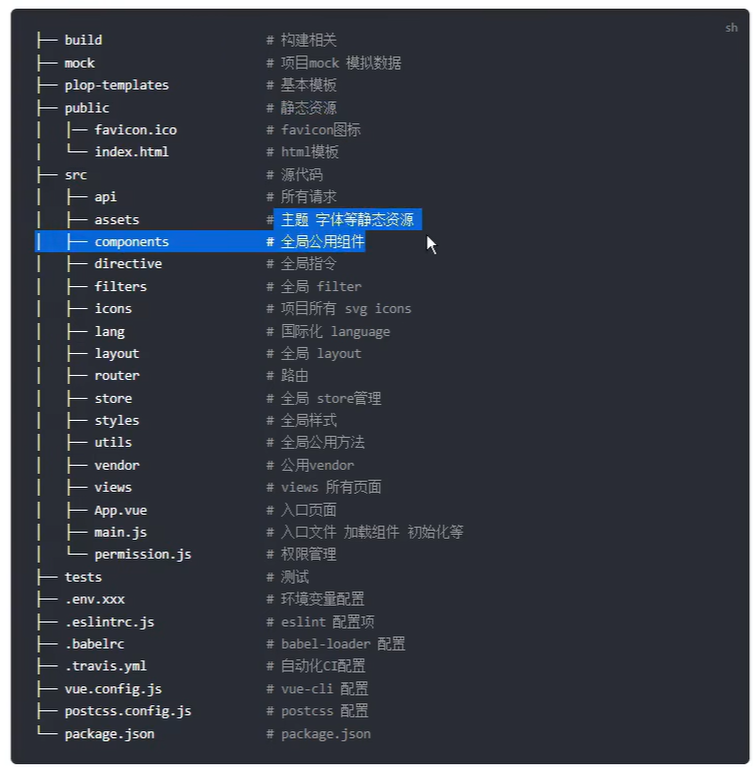

前端vue3

Frontends
    node （windows安装：.msi）
    npm instll axios
    创建vue3项目
        npm init vite-app <frontends>   // 便捷安装
        npm init vite@latest            // 最新版本安装
    切换vue3项目目录: 
        cd frontends
    安装相应依赖
        npm install
    安装其他
        npm install less
        npm install vue-router@版本号
    启动服务
        npm run dev 

vite 前端构建工具
    构建工具
        typescript：如果遇到 ts 文件需要使用 tsc 将 typescript 代码转换为 js 代码
        React/Vue：
        less/sass/postcss/componet-style：
        语法降级：babel
        体积优化：uglifyjs
        ...
        模块化开发
        代码兼容性
        提高性能
        优化开发体验：热更新
        开发服务器：跨域
        常见构建工具：webpack、vite、parcel、esbuild、rollup、grunt、gulp
    vite优点
        开发服务器启动快
        依赖预构建
    vite缺点
    创建项目
        npm init vite-app <frontends>
            1.安装vite脚手架 vite-app
            2.运行
    配置书写规范
        esmodule 规范
        commonjs 规范
    配置
        vite.config.js
            可以书写为 esmodule 形式或 commonjs 形式

    vite环境变量配置
        当前代码环境：开发环境/生产环境
        第三方库（vite内置）：dotenv
            自动读取/解析 .env 文件中的环境变量
            将环境变量注入到 process 对象中，与vite.config.js中的配置有关：root/envDir（当前环境变量地址）
            配置文件
                .env  所有环境都需要用到的环境变量
                .env.development  开发环境变量（vite默认的开发环境名称：development）
                .env.production  生产环境变量（vite默认的生产环境名称：production）
            变量注入
                服务端
                    const baseEnvConfig = 读取.env配置
                    const modeEnvConfig = 读取env相关配置
                    const lastEnvConfig = { ...baseEnvConfig, ...modeEnvConfig }
                客户端
                    import.meta.env  //如果环境变量前缀是 VITE 开头，vite将会拦截并注入环境变量,如若更改此前缀，可使用envPrefix配置
    预处理器 less

    TypeScript

    状态管理 Pinia 

    插件

    项目入口文件：index.html

    静态资源

    配置文件 .env
        VITE_XXLX_API_URL = http://testapi.xuexiluxian.cn
        VITE_CVB_API_URL = http://127.0.0.1:8000
        VITE_USER_API_URL = http://39.97.218.60

导航守卫
全局前置守卫: 使用 router.beforeEach 注册

目录结构
public
src
    api
    assets
    components
    router
    store
    utils
        aes.js  加密/解密
    views
    App.vue
    main.js
test
index.html
package.json
vite.config.js

【硅谷甄选】
首页
数据大屏
权限管理
    用户管理：admin：（超级管理员、运营管理）,111：（库存管理员）
    角色管理：前台，超级管理员，库存管理员，数据管理员，产品管理员，运营管理员
    菜单管理
商品管理